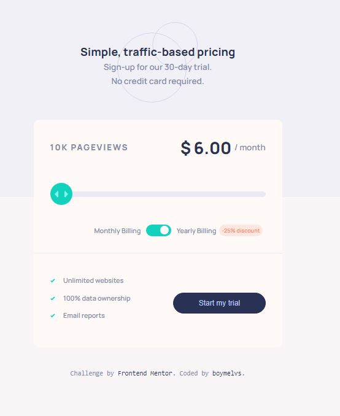

# Frontend Mentor - Interactive pricing component solution

## Table of contents

-  [Overview](#overview)
   -  [The challenge](#the-challenge)
   -  [Page view and Pricing Totals](#page-view-and-pricing-totals)
   -  [Screenshot](#screenshot)
   -  [Links](#links)
   -  [Built with](#built-with)
-  [Author](#author)

## Welcome! 👋

Thanks for checking out this front-end coding challenge.

## Overview

This is a solution to the [Interactive pricing component challenge on Frontend Mentor](https://www.frontendmentor.io/challenges/interactive-pricing-component-t0m8PIyY8).

### The challenge

Users should be able to:

-  View the optimal layout for the app depending on their device's screen size
-  See hover states for all interactive elements on the page
-  Use the slider and toggle to see prices for different page view numbers

### Page view and pricing totals

Here are the different page view ranges and the corresponding monthly price totals:

-  10K pageviews / $8 per month
-  50K pageviews / $12 per month
-  100K pageviews / $16 per month
-  500k pageviews / $24 per month
-  1M pageviews / $36 per month

If the visitor switches the toggle to yearly billing, a 25% discount should be applied to all prices.

### Screenshot

### Links

-  Live Site URL: [Interactive pricing component solution](https://boymelvs.github.io/interactive-pricing-component)

### Built with

-  HTML
-  Flexbox
-  CSS
-  Grid
-  Javascript

## Author

-  Frontend Mentor - [Melvin](https://www.frontendmentor.io/profile/boymelvs)
